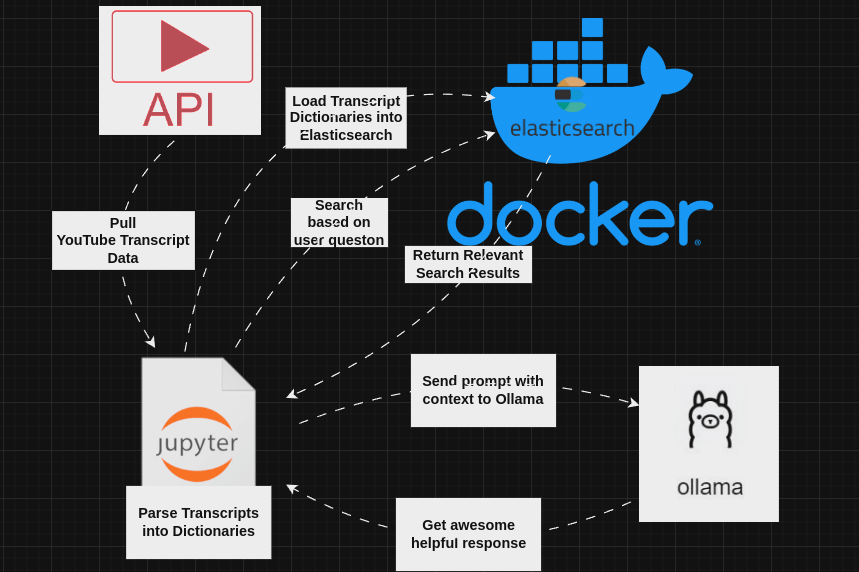

# PlaylistTranscriptLLM
Simple setup for downloading all transcripts from a YouTube Playlist Loading them into Elasticsearch and searching with an LLM

## Data Flow Diagram

## Setup:
In GCP enable the YouTube API V3 
Generate an API_KEY 
Place it in a .env file and title the entry YouTube_API_KEY 
Run get_transcripts_timestamps.py 
Run the cells in Ask_LLM.ipynb 

## Elasticsearch
You will need Elastic search running 
docker run -it \
    --rm \
    --name elasticsearch \
    -p 9200:9200 \
    -p 9300:9300 \
    -e "discovery.type=single-node" \
    -e "xpack.security.enabled=false" \
    -e "ES_JAVA_OPTS=-Xms512m -Xmx512m" \
    -e "bootstrap.memory_lock=false" \
    docker.elastic.co/elasticsearch/elasticsearch:8.4.3

And ollama installed and running. To use a different model change phi3 to a different model in the Elasticsearch_LLM.ipynb Notebook
